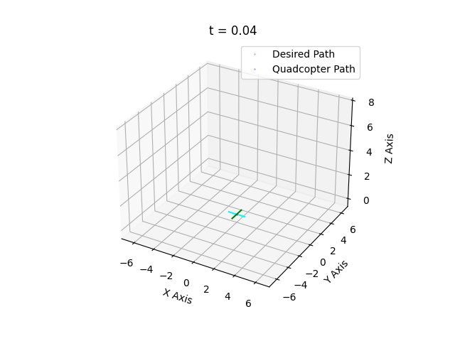

Quadrotor Robot Motion Planning and Control Simulation
======================================================

This system simulates a quadrotor UAV (Unmanned Aerial Vehicle) in a 3D environment, focusing on motion planning and control. Users can simulate the quadrotor following three different types of trajectories: line, helix, and circle.

# Examples of line, helix, and circle trajectory

<table>
  <tr>
    <td></td>
    <td></td>
    <td></td>
  </tr>
</table>


Prerequisites:
---------------
- Python 3.x
- NumPy
- SciPy
- Matplotlib

Running the Simulation:
------------------------
To run the simulation, simply run the following command in the terminal:

```
python simulate.py
```
When prompted, enter the desired trajectory type:
- Type 'line' for a linear trajectory.
- Type 'helix' for a helical trajectory.
- Type 'circle' for a circular trajectory.

The simulation will start and display the quadrotor's movement in real-time. Upon completion, a GIF animation of the quadrotor's trajectory will be saved in the current directory.

The animations are named according to the trajectory type (e.g., `animation_line.gif`, `animation_helix.gif`, `animation_circle.gif`).

For more information or support, please contact ng.khiem97vn@gmail.com.